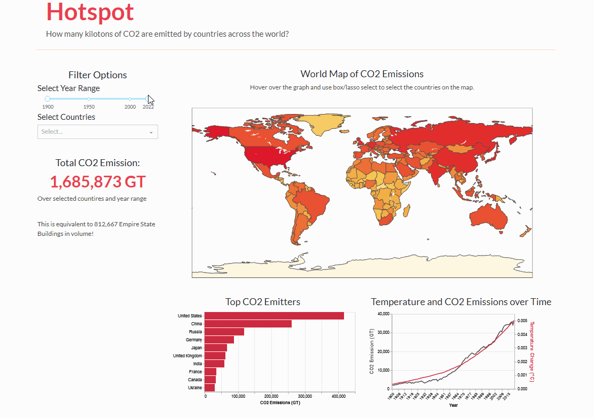

Surasak Suwanmake//Getty Images

# 🔥Hotspot - Visualization of Global Warming and CO2 Emission

[](https://www.repostatus.org/#active) [](https://www.python.org/downloads/release/python-390/)[](https://opensource.org/licenses/MIT)

## 📖 The Problem
Climate change is a defining problem of the 21st century. In order to limit global temperature increase to 1.5°, we must achieve net zero emissions by 2050. This is an ambitious goal, and a key step in achieving it is understanding precisely where our emissions are coming from so we can take action.

## 💡 The Solution

We aim to build an innovative tool to visualize CO2 emission sources in an intuitive way. To be more specific, we want to inspect the dynamics between CO2 emissions, global temperature changes, and economic activity indicators (e.g GDP per capita) over the years. By providing a user-friendly interface that allows for investigating the data both globally and at the country level, the dashboard seeks to make abstract and sometimes overwhelming data on climate change more tangible and understandable.

## 🏃 Usage



### 🚀 Quick Start

Visit the [HotSpot Dashboard](https://hotspot-tracking-co2-emission-across-the.onrender.com/) to view the dashboard.

### 💻 Developer Guide

1. Clone the repository
2. Create the virtual environment

```bash
conda env create -f environment.yml
conda activate hotspot
```

3. Make sure `src/app.py` is set to `debug=True` for development purposes

```python
if __name__ == "__main__":
    app.run(debug=True)
```

4. Run the dashboard

```bash
python -m src.app
```

## ©️ License

The HotSpot dashboard is licensed under the terms of the MIT license.

## 👥 Contributors:

[@farrandi](https://github.com/farrandi)
[@monazhu](https://github.com/monazhu)
[@juliaeveritt](https://github.com/juliaeveritt)
[@Rachel0619](https://github.com/Rachel0619)

## 🤝 Contributing

Contributions are welcome! If you have suggestions or want to improve the project, please feel free to contribute. You can do so by forking the repository, making your changes, and submitting a pull request. For bug reports or feature requests, please open an issue. Thank you for your support in making our project better!

## Reference

data source: https://github.com/owid/co2-data?tab=readme-ov-file
