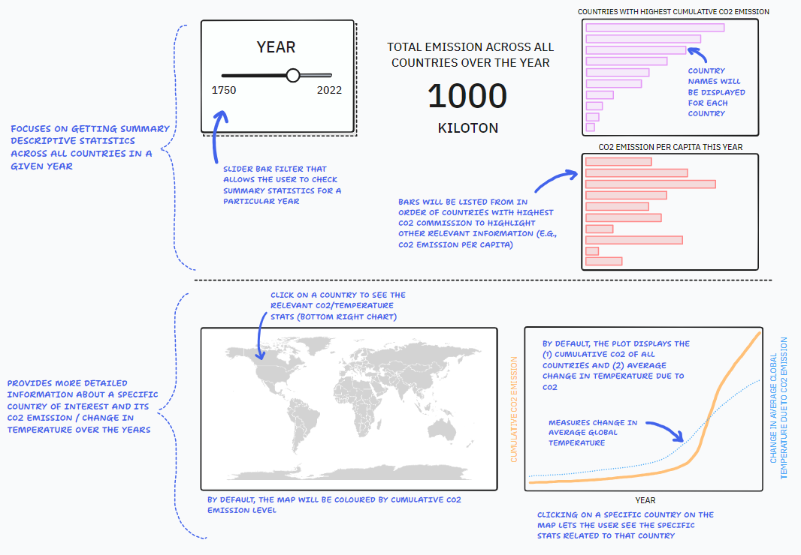

# Proposal

## 1. Motivation and purpose

## 2. Description of the data

## 3. Research questions

## 4. App sketch and description

Below is a sketch of our proposed dashboard.

Our proposed dashboard comprises two parts. At the top, we provide our users with general statistics regarding the total CO2 emission for any given year, which can be adjusted by the toggle bar on the top left hand side. Based on this information, we can also see the top 10 countries in order of CO2 emission at a given point in time (as measured by cumulative CO2 emission up until that year), as well as the CO2 emission per capita for that specific year. Note that the default is set to the most recent year in which data is available (i.e., 2022).

At the bottom, the dashboard provides users with a way to explore the data for a given country in more detail. By default, the map shows the degree of CO2 emission by country on a colour scale, and next to it, the cumulative CO2 emission over time (orange line) as well as the change in average global temperature across the same time frame for reference (dotted blue line). Note that the latter does not change, as it serves as a meausre of global temperature change over time. By clicking on a specific country (e.g., Canada), the user will be able to see its specific cumulative CO2 emission over time.
